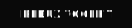
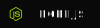
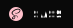

## Frontend Developer (JS, React)

### MAIN STACK:

     
    

### OTHER SKILLS:

     

---

### CERTIFICATES:

> <a href="https://www.udemy.com/certificate/UC-5d544e83-3130-42df-9857-1eb0be7f2ded/">UDEMY: PYTHON 3</a> 

> <a href="https://www.udemy.com/certificate/UC-3fe34770-dab3-4771-ad1d-cb7b75b31871/">UDEMY: SQL and POSTGRESQL</a> 

> <a href="https://www.udemy.com/certificate/UC-aa5f9c4d-6dc1-484f-8371-c42fe82c1ace/">UDEMY: GIT</a> 

> <a href="https://www.udemy.com/certificate/UC-38b56ec8-76d7-405f-bed0-a0cfb2029076/">UDEMY: HTML5 & CSS3</a> 

> <a href="https://www.udemy.com/certificate/UC-6aa811df-274c-46be-9fbb-78652ff50aa9/">UDEMY: JavaScript ES6+</a> 

> <a href="https://www.udemy.com/certificate/UC-0612fb88-13f2-484c-92d5-007facf04595/">UDEMY: JavaScript ES6+</a> 

> <a href="https://www.udemy.com/certificate/UC-4e5d6ac3-d3f2-45af-9330-0c2415fccd7c/">UDEMY: React JS</a> 

> <a href="https://www.udemy.com/certificate/UC-f1e26658-a32d-4b99-be0a-c27815115a9d/">UDEMY: React JS</a> 

---

### CONTACTS:

EMAIL: abubjazov@mail.ru

---

